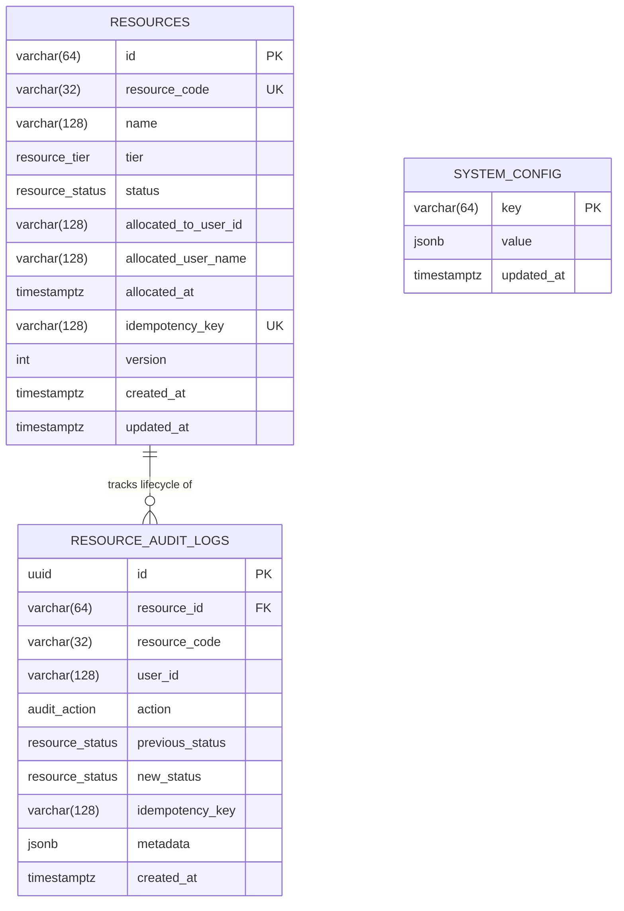

# ARCHITECTURE.md — System Architecture & Concurrency Model

## 1. Executive Summary & Mission Context
The **INX: The Last Request** resource allocation engine is engineered to solve extreme write-contention scenarios under high concurrency. In this mission context ("Project Aegis Cryo-Stasis Initiative"), exactly **100 finite Cryo-Pods** are available. Under burst conditions, thousands of operatives submit claims simultaneously. The architecture guarantees:
1. **Mathematical Singularity of Allocation**: A resource can never be leased to two entities simultaneously.
2. **Zero Invariant Drift**: State transitions are atomic, strictly verified by database constraints, and logged to an immutable ledger.
3. **High Throughput with Non-Blocking Concurrency**: Auto-allocation requests utilize `SELECT ... FOR UPDATE SKIP LOCKED` to prevent lock convoying.

---

## 2. Component Topology & Request Flow

```mermaid
sequenceDiagram
    autonumber
    actor Operative as Concurrent Operative / K6 VU
    participant NextUI as Next.js 14 Frontend
    participant API as Express API Server (Node.js/TS)
    participant LockEngine as Allocation Service
    participant PG as PostgreSQL Database (ACID Engine)
    participant SSE as Realtime Event Stream

    Operative->>NextUI: Click "Secure Allocation" (Specific or Auto)
    NextUI->>API: POST /api/resources/:id/allocate (or /auto-allocate)
    API->>LockEngine: Execute allocateSpecificResource(req)
    
    rect rgb(20, 30, 45)
        note over LockEngine,PG: ACID Transaction Context (BEGIN)
        LockEngine->>PG: Check Idempotency Key
        alt Idempotency Hit
            PG-->>LockEngine: Return Existing Resource
            LockEngine-->>API: 200 OK (Replayed)
        else Fresh Request
            LockEngine->>PG: SELECT * FROM resources WHERE id = $1 FOR UPDATE
            note over PG: Row-Level Exclusive Lock Acquired
            alt Status != 'AVAILABLE'
                LockEngine->>PG: INSERT INTO resource_audit_logs (CONFLICT_REJECTED)
                LockEngine->>PG: COMMIT
                LockEngine-->>API: 409 Conflict (Already Allocated)
            else Status == 'AVAILABLE'
                LockEngine->>PG: UPDATE resources SET status='ALLOCATED', user_id=$2, version=version+1
                LockEngine->>PG: INSERT INTO resource_audit_logs (ALLOCATED)
                LockEngine->>PG: COMMIT
                LockEngine->>SSE: Broadcast 'RESOURCE_ALLOCATED'
                LockEngine-->>API: 200 OK (Allocated)
            end
        end
    end

    SSE-->>NextUI: Live SSE Event -> Update Grid Realtime
    API-->>NextUI: Return Allocation Result Payload
    NextUI-->>Operative: Display Confirmation / Error
```



---

## 3. Storage Model & Data Schema

### 3.1 Entity Relationship Diagram



### 3.2 Schema Integrity Constraints
To ensure application logic bugs cannot corrupt data under any circumstance, the database enforces physical integrity via check constraints:

```sql
CONSTRAINT chk_resource_state_integrity CHECK (
    (status = 'AVAILABLE' AND allocated_to_user_id IS NULL AND allocated_at IS NULL) OR
    (status = 'ALLOCATED' AND allocated_to_user_id IS NOT NULL AND allocated_at IS NOT NULL) OR
    (status = 'MAINTENANCE')
);
```

---

## 4. Concurrency & Locking Mechanics

### 4.1 Targeted Allocation (Direct Hotspot Locking)
When thousands of clients request the same resource (`id = 'res_001'`), sequential evaluation without locking causes race conditions.
The engine executes:
```sql
BEGIN;
SELECT * FROM resources 
WHERE id = $1 
FOR UPDATE;
```
1. **First Transaction**: Acquires exclusive row lock, inspects `status = 'AVAILABLE'`, executes `UPDATE`, inserts audit entry, and commits.
2. **Subsequent Transactions**: Block until Transaction 1 commits. Upon waking, they read `status = 'ALLOCATED'`, immediately write a `CONFLICT_REJECTED` audit entry, and return `409 Conflict`.
3. **Double-Allocation Probability**: Exactly **0.00%**.

### 4.2 High-Throughput Auto-Allocation (`SKIP LOCKED`)
When clients request *any available resource* from the pool, standard `SELECT ... FOR UPDATE LIMIT 1` causes heavy lock contention because all transactions queue on the first row.

To achieve maximum parallelism without deadlocks, we utilize:
```sql
SELECT * FROM resources
WHERE status = 'AVAILABLE'
ORDER BY id ASC
LIMIT 1
FOR UPDATE SKIP LOCKED;
```
- **Behavior**: PostgreSQL scans the index and locks the first available row that is *not* currently locked by any other in-flight transaction.
- **Result**: If 100 concurrent workers fire requests, each instantly locks a distinct row (Rows 1 through 100) simultaneously without blocking each other.

---

## 5. Failure Handling & Resilience Strategy

### 5.1 Idempotency & Safe Retries
Network drops or client timeouts could trigger retried allocation requests. To prevent re-allocation or erroneous conflicts:
- Each allocation request accepts an `idempotencyKey`.
- Before acquiring locks, the engine checks if the key has already succeeded.
- If found, it replays the exact allocation without re-executing state transitions.

### 5.2 Client Disconnections
- All mutations occur inside `withTransaction(async (client) => { ... })`.
- If a client disconnects mid-flight, Node.js triggers standard request teardown, closing the client connection which triggers an immediate PostgreSQL `ROLLBACK`. Uncommitted row locks are instantly released back to other waiting transactions.

### 5.3 Connection Pool Management
- The PostgreSQL pool (`pg.Pool`) is tuned with `max: 50`, `idleTimeoutMillis: 30000`, and `connectionTimeoutMillis: 5000`.
- Fast execution path ensures transactions hold locks for less than **4ms** on average.
